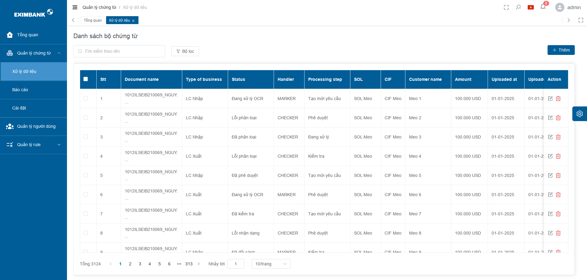
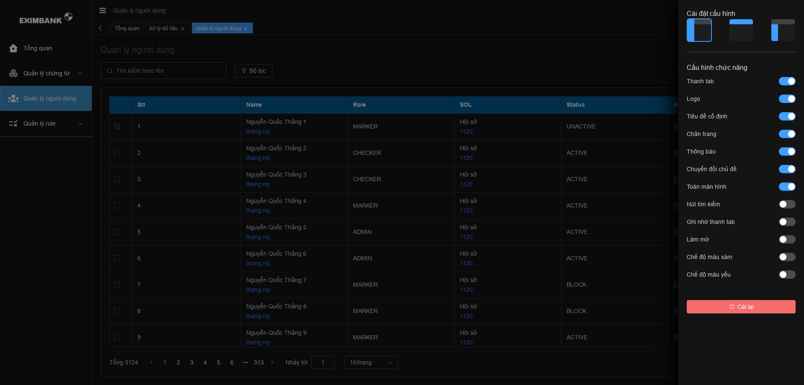
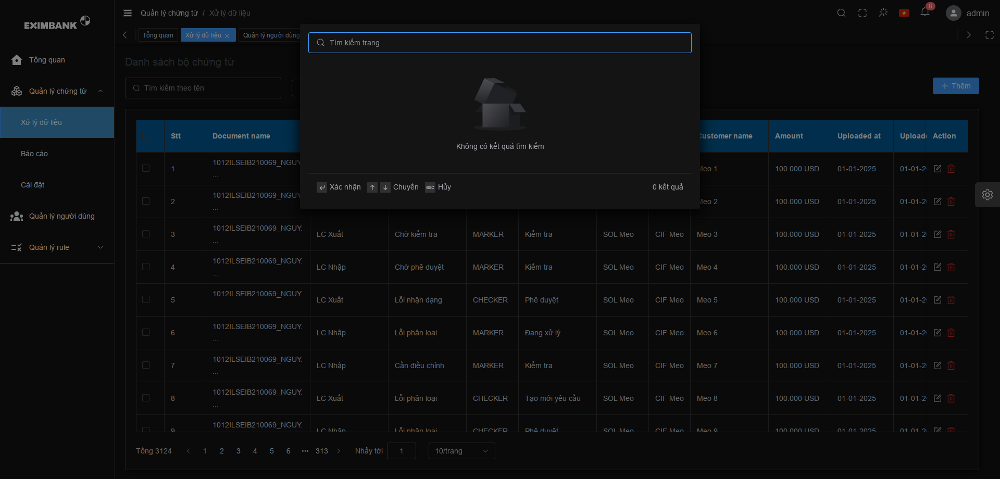

# eximbank-ui

<div align="center">
  
  <h1>Viettel IDP</h1>
  <span><a href="./README.vi.md">Vietnamese</a> | English</span>
</div>

## ⚡ Introduction

Eximbank OCR is a free and open source middle and background management system basic solution, based on mainstream framework such as Vue3, TypeScript, Element Plus, Pinia and Vite

## 📚 Document

- Vue3 documentation: [https://vuejs.org/](https://vuejs.org/)
- Typescript documentation: [https://www.typescriptlang.org/](https://www.typescriptlang.org/)
- Element Plus documentation: [https://element-plus.org](https://element-plus.org/en-US/)
- Pinia documentation: [https://pinia.vuejs.org/](https://pinia.vuejs.org/)
- Vite documentation: [https://vitejs.dev/](https://vitejs.dev/)
- Eslint documentation: [https://eslint.org/](https://eslint.org/)
- Prettier documentation: [https://prettier.io/](https://prettier.io/)
- Tailwind documentation: [https://tailwindcss.com/](https://tailwindcss.com/)

## Feature

- **Vue3**：The latest Vue3 composition API using Vue3 + script setup
- **Element Plus**：Vue3 version of Element UI
- **Pinia**: An alternative to Vuex in Vue3
- **Vite**：Really fast
- **Vue Router**：router
- **TypeScript**：JavaScript With Syntax For Types
- **PNPM**：Faster, disk space saving package management tool
- **Scss**：Consistent with Element Plus
- **CSS variable**：Mainly controls the layout and color of the item
- **ESlint**：Code verification
- **Prettier**： Code formatting
- **Axios**: Promise based HTTP client (encapsulated)
- **TailwindCSS**: Fast, efficient CSS with predefined classes

## Functions

- **User management**: Log in and out of the demo
- **Authority management**: Page-level permissions (dynamic routing), button-level permissions (directive permissions, permission functions), and route navigation guards
- **Multiple Environments**: Development, Staging, Production
- **Multiple themes**: Normal, Dark, Dark Blue, three theme modes
- **Multiple layouts**：Left, Top, Left Top, three layout modes
- **Error page**: 403, 404
- **Dashboard**: Display different Dashboard pages according to different users
- **Other functions**：SVG, Dynamic Sidebar, Dynamic Breadcrumb Navigation, Tabbed Navigation, Screenfull, Adaptive Shrink Sidebar, Hook (Composables)

## 🚀 Development

```bash
# configure
1. installation of the recommended plugins in the .vscode directory
2. node version 18.x or 20+
3. pnpm version 8.x or latest

# clone
git clone http://source.cyberspace.vn/tgmt/ocr/eximbank/eximbank-ui.git

# enter the project directory
cd eximbank-ui

# install dependencies
pnpm i

# start the service
pnpm dev
```

## ✔️ Preview

```bash
# stage environment
pnpm preview:stage

# prod environment
pnpm preview:prod
```

## 📦️ Multi-environment packaging

```bash
# build the stage environment
pnpm build:stage

# build the prod environment
pnpm build:prod
```

## 🔧 Code inspection

```bash
# code formatting(auto fix)
pnpm lint:prettier

# code verification(auto fix)
pnpm lint:eslint

# code verification and code formatting(auto fix)
pnpm lint

# unit test
pnpm test
```

## Git commit specification reference

- `feat` add new functions
- `fix` Fix issues/bugs
- `perf` Optimize performance
- `style` Change the code style without affecting the running result
- `refactor` Re-factor code
- `revert` Undo changes
- `test` Test related, does not involve changes to business code
- `docs` Documentation and Annotation
- `chore` Updating dependencies/modifying scaffolding configuration, etc.
- `workflow` Work flow Improvements
- `ci` CICD
- `types` Type definition
- `wip` In development

## Project preview





## ☕ Donate
